# Site-to-Site VPN: TP-Link ER605 to Azure VPN Gateway

This lab documents a working site-to-site VPN connecting a home TP-Link ER605 router (managed via Omada) to an Azure VPN Gateway. The end result: SSH into a private Azure VM over an IPsec tunnel — no public IP, no Bastion, no jump host.

---

## AZ-104 Exam Relevance

This lab covers the following AZ-104 exam objectives:

- **Configure virtual networks** — subnets, address spaces, the dedicated GatewaySubnet
- **Configure VPN gateways** — SKUs, gateway type, VPN type (route-based vs. policy-based)
- **Configure site-to-site connections** — IKE, IPsec, PSK authentication
- **Local Network Gateway** — how Azure represents the on-premises side
- **Hybrid connectivity** — connecting on-premises networks to Azure without ExpressRoute
- **Private VM access** — why VPN removes the need for public IPs or Azure Bastion

---

## Architecture

```
MacBook (10.2.0.100)
    │
    │  Ethernet — port 4 (VLAN3 untagged)
    ▼
TP-Link ER605
  ├── LAN1: 192.168.5.0/24  (VLAN1, all ports untagged)
  └── LAN2: 10.2.0.0/16     (VLAN3, port 4 untagged → MacBook gets 10.2.x.x)
    │
    │  IPsec tunnel (IKEv2 / AES-256 / SHA1)
    │  NAT: ER605 (192.168.0.194) → Telenet public IP (<REDACTED-PUBLIC-IP>)
    ▼
Telenet modem (192.168.0.1 / NAT gateway)
    │
    │  internet
    ▼
Azure VPN Gateway — vnet-gateway-1 (20.103.209.44)
    │
    │  vnet-hybrid (10.0.0.0/16)
    ▼
vm-internal @ subnet1 (10.0.1.4)
```

**Traffic selector**: `10.2.0.0/16 ↔ 10.0.0.0/16`

Devices on LAN1 (`192.168.5.x`) cannot use the tunnel — the traffic selector only covers LAN2. A device must receive a `10.2.x.x` address to route through the VPN.

---

## Azure Configuration

### Virtual Network

| Resource | Value |
|---|---|
| VNet name | `vnet-hybrid` |
| Address space | `10.0.0.0/16` |
| `subnet1` | `10.0.1.0/24` — VM workloads live here |
| `subnet2` | `10.0.3.0/24` |
| `GatewaySubnet` | `10.0.2.0/24` |

> The `GatewaySubnet` is a reserved subnet name. Azure requires it to host the VPN Gateway. It must not contain any other resources.

### VPN Gateway

| Field | Value |
|---|---|
| Name | `vnet-gateway-1` |
| SKU | **Basic** |
| Gateway type | VPN |
| VPN type | Route-based |
| Public IP | `20.103.209.44` (`vnet-gateway-public-ip`) |
| Virtual network | `vnet-hybrid` |

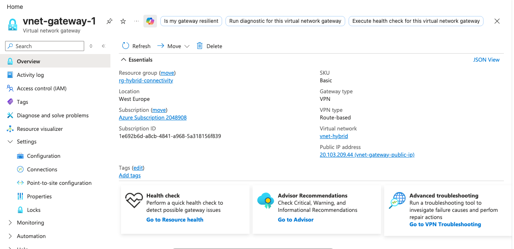

> **SKU note (AZ-104)**: The Basic SKU does not support custom IKE/IPsec policies, zone redundancy, active-active mode, or BGP. It is only suitable for dev/test. For production use, choose VpnGw1 or higher.

### Local Network Gateway

The Local Network Gateway tells Azure what to expect from the on-premises side — the router's public IP and the address space behind it.

| Field | Value |
|---|---|
| Name | `local-network-gateway-1` |
| IP address | `<REDACTED-PUBLIC-IP>` (Telenet-assigned public IP) |
| Address space | `10.2.0.0/16` (ER605 LAN2) |

> **If your home IP changes**: Telenet may reassign your public IP. Update the Local Network Gateway IP address to restore the tunnel.

### Connection

| Field | Value |
|---|---|
| Name | `site-to-site-connection-1` |
| Type | Site-to-site (IPsec) |
| IKE protocol | IKEv2 |
| IPsec/IKE policy | Default |
| Authentication | Pre-shared Key (PSK) |
| Connection mode | Default |

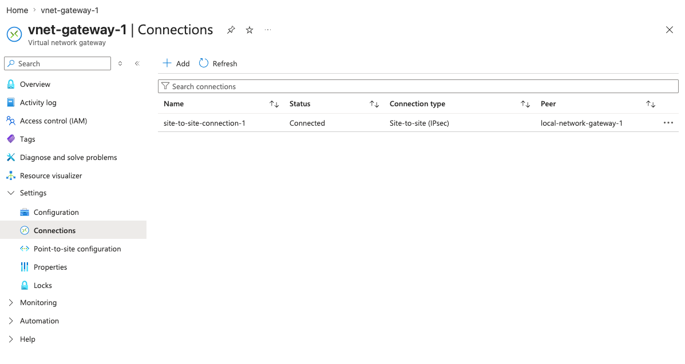

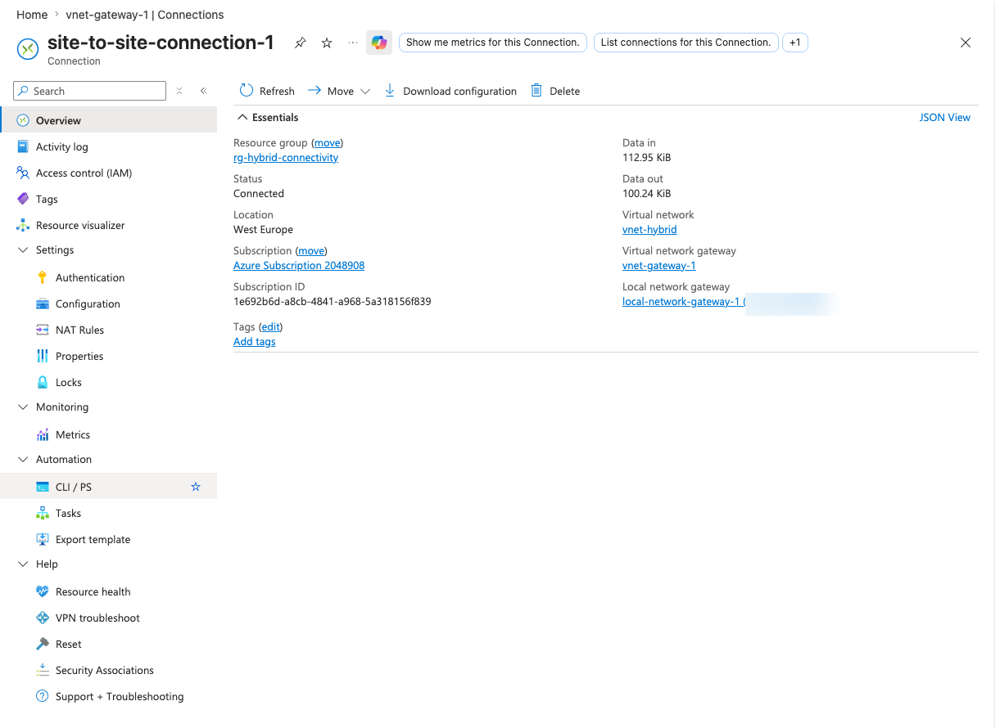

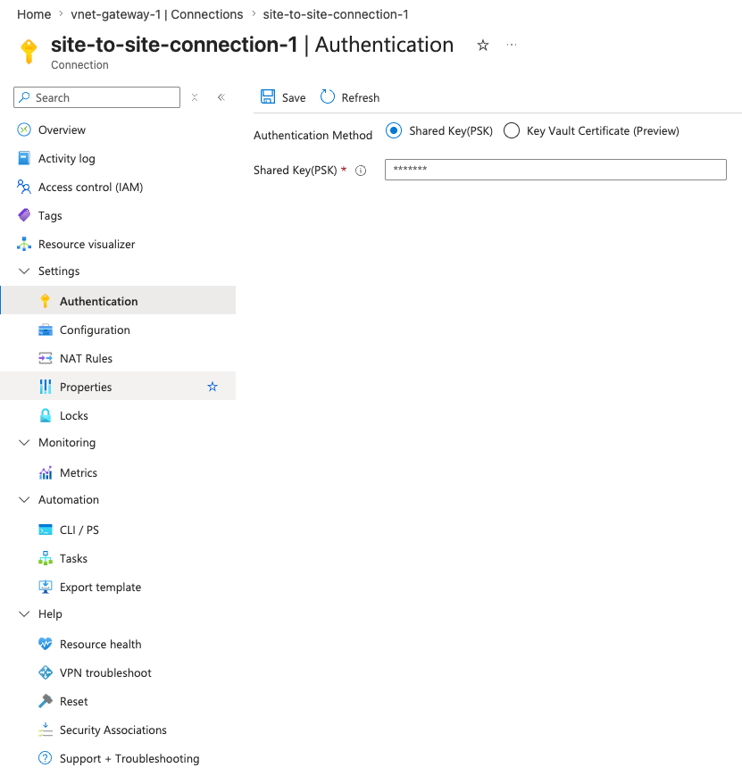

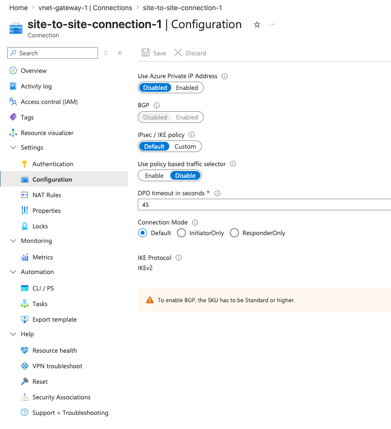

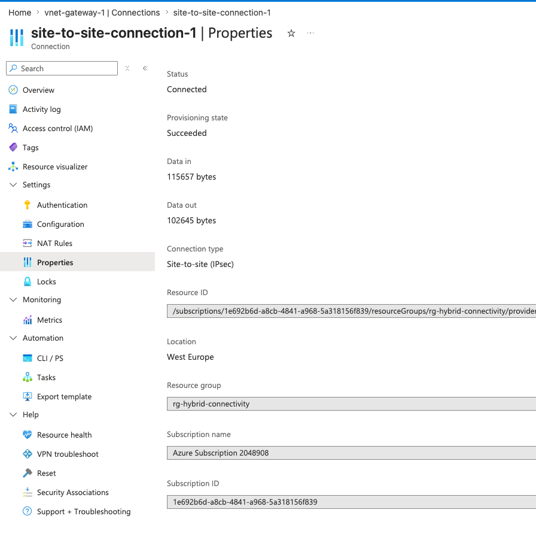

---

## ER605 Configuration

### LAN Networks

Two LAN networks are configured on the ER605. Only LAN2 participates in the VPN tunnel.

| ID | Name | VLAN ID | Gateway IP | Subnet | DHCP |
|---|---|---|---|---|---|
| 1 | LAN | 1 | 192.168.5.1 | 255.255.255.0 | Enabled |
| 2 | LAN2 | 3 | 10.2.0.1 | 255.255.0.0 | Enabled |

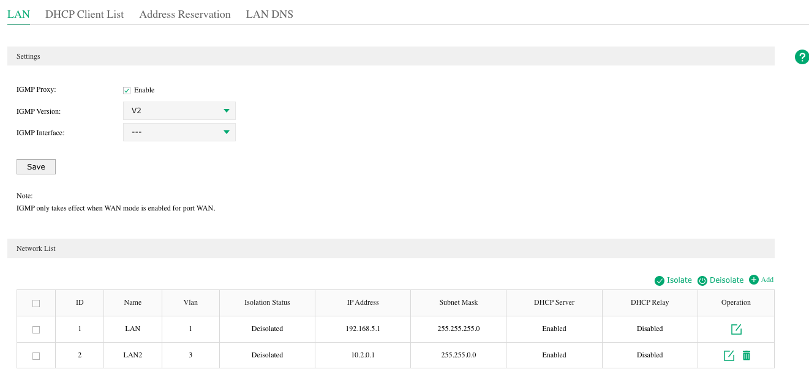

### VLAN Port Assignment

VLANs (802.1Q) create logically separate Layer 2 networks on the same physical switch. Each frame can carry a VLAN tag identifying which network it belongs to. The ER605's built-in managed switch uses this to determine which LAN a connected device joins.

Each port has two possible roles per VLAN:

- **UNTAG (access)** — The switch *strips* the VLAN tag on frames going out this port, and *adds* the VLAN tag on frames arriving untagged. A regular device (laptop, printer) doesn't need to know about VLANs — it sends and receives normal Ethernet frames, and the switch handles tagging internally. The PVID (Port VLAN ID) determines which VLAN untagged ingress traffic is assigned to.
- **TAG (trunk)** — The 802.1Q tag is preserved in both directions. Used for uplinks to other switches or VLAN-aware devices that need to handle multiple VLANs simultaneously.

A port has exactly one **PVID** — when a device sends an untagged frame, the switch assigns it to that VLAN. This is what determines which LAN network the device lands on, and which DHCP server responds.

| VLAN | Port 2 | Port 3 | Port 4 | Port 5 |
|---|---|---|---|---|
| vlan1 (LAN) | UNTAG | UNTAG | UNTAG | UNTAG |
| vlan3 (LAN2) | TAG | TAG | **UNTAG** | TAG |

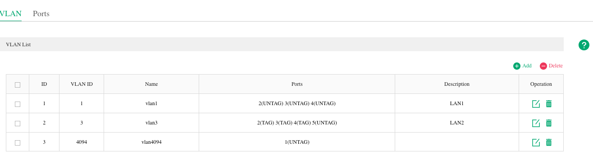

Reading this table:
- **Ports 2, 3, 5** are tagged on VLAN3 — used for uplinks or VLAN-aware devices that carry both VLANs. Any ordinary device plugged in here would land on VLAN1 (LAN, 192.168.5.x) because that's their PVID.
- **Port 4** is untagged on VLAN3, with PVID=3 — plugging the MacBook into port 4 causes the switch to assign its untagged frames to VLAN3. The LAN2 DHCP server responds and assigns a `10.2.x.x` address. The MacBook needs no VLAN configuration at all.

Before this change, port 4 had PVID=1 (default), so the MacBook was on VLAN1 and got a `192.168.5.x` address from LAN1.

#### Why not just put the MacBook on LAN1 and adjust the VPN traffic selector?

When the MacBook was on LAN1 (`192.168.5.x`), an alternative was proposed:
- Change the ER605 IPsec policy: Local Networks = LAN (`192.168.5.0/24`)
- Update the Azure Local Network Gateway address space to `192.168.5.0/24`

**This would have worked.** The IPsec traffic selector would become `192.168.5.0/24 ↔ 10.0.0.0/16`. Any device on LAN1 sending traffic destined for `10.0.x.x` would have it encrypted and sent through the tunnel. Azure would route return traffic back through the tunnel because the Local Network Gateway says `192.168.5.0/24` is on-premises.

The reason to prefer the VLAN approach instead:

| Concern | LAN1 approach (`192.168.5.0/24`) | LAN2 approach (`10.2.0.0/16`) |
|---|---|---|
| Setup effort | Simpler — no VLAN changes | Requires VLAN + port config |
| Scope | ALL LAN1 devices can reach Azure via VPN | Only devices intentionally placed on LAN2 |
| Segmentation | Home devices (printers, IoT, etc.) share the VPN network | VPN access is an explicit, separate network |
| Realism | Less enterprise-like | Mirrors how on-premises networks are typically segmented in hybrid Azure architectures |

For a home lab with one device, the LAN1 approach is fine. For the AZ-104 exam, the LAN2/VLAN design is more representative of real-world deployments where the "VPN-connected subnet" is a distinct, intentional network segment.

### IPsec Policy

**Basic settings:**

| Field | Value |
|---|---|
| Policy name | `policy1` |
| Mode | LAN-to-LAN |
| Remote Gateway | `20.103.209.44` |
| WAN | WAN1 |
| Local Networks | LAN2 (`10.2.0.0/16`) |
| Remote Subnet | `10.0.0.0/16` |
| Pre-shared Key | *(your PSK — must match the Azure connection PSK)* |

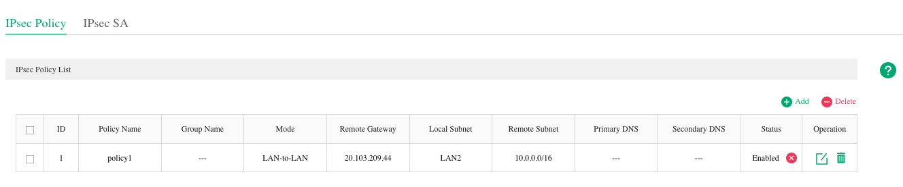

**Phase 1 (IKE):**

| Field | Value |
|---|---|
| IKE Version | IKEv2 |
| Negotiation Mode | **Initiator** |
| Proposals | Default (all) |
| SA Lifetime | 28800s |
| DPD | Enabled |

**Phase 2 (IPsec):**

| Field | Value |
|---|---|
| Encapsulation | Tunnel Mode |
| Proposals | Default (all) |
| PFS | None |
| SA Lifetime | 28800s |

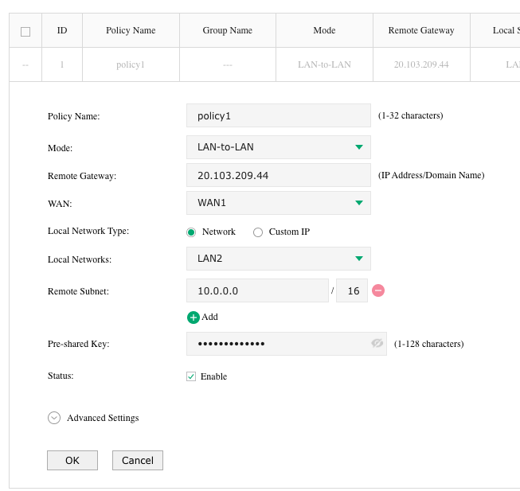

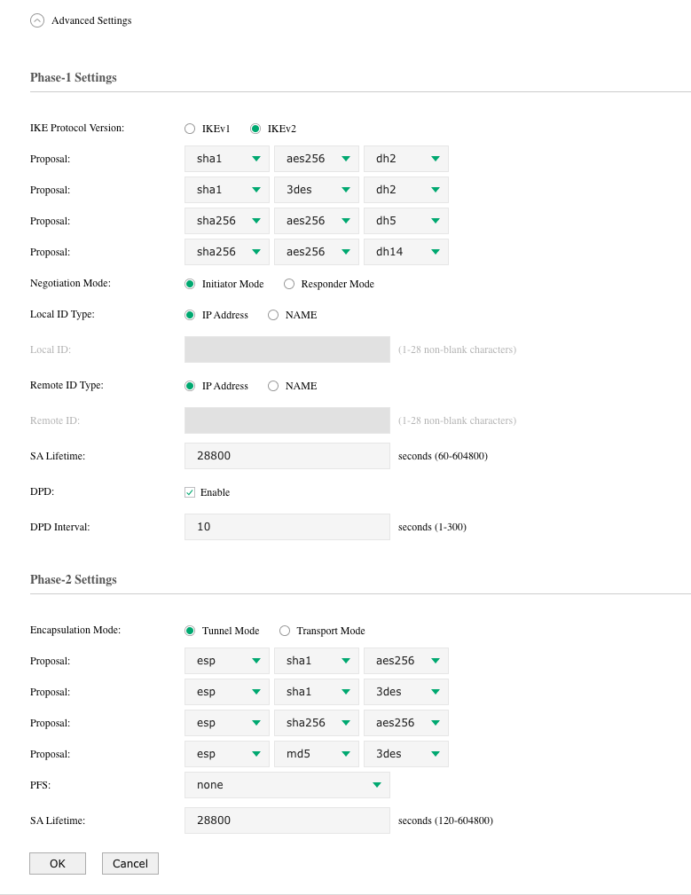

> **Why "Default (all)" proposals?** The ER605 sends all supported crypto proposals to Azure. Azure's Basic SKU accepts a fixed set (AES-256/SHA1). Since the ER605 includes those in its offer, IKE negotiation succeeds automatically — no manual alignment needed.

### Why No DMZ or Port Forwarding Is Needed

The ER605 is configured as the **Initiator**. It opens the IKE negotiation outbound to Azure on UDP 500/4500. The Telenet modem's NAT table tracks that outbound session and lets Azure's replies through automatically.

DMZ or inbound firewall rules would only be needed if Azure were trying to initiate the connection to the ER605 unprompted.

---

## Verification

### Tunnel Status — ER605 IPsec SA

When the tunnel is established, the IPsec SA table shows two entries (one per direction):

| Direction | Tunnel | Data Flow | Protocol | ESP Auth | ESP Enc |
|---|---|---|---|---|---|
| in | `20.103.209.44 → 192.168.0.194` | `10.0.0.0/16 → 10.2.0.0/16` | ESP | SHA1 | AES-256 |
| out | `192.168.0.194 → 20.103.209.44` | `10.2.0.0/16 → 10.0.0.0/16` | ESP | SHA1 | AES-256 |

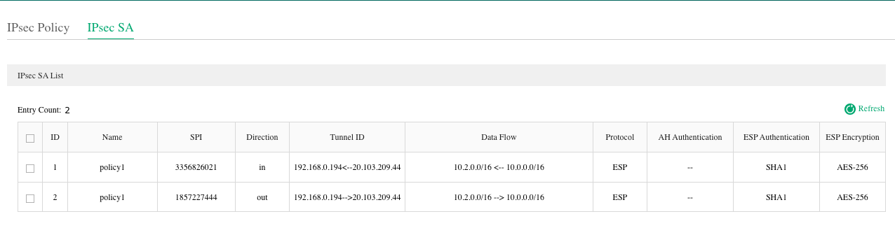

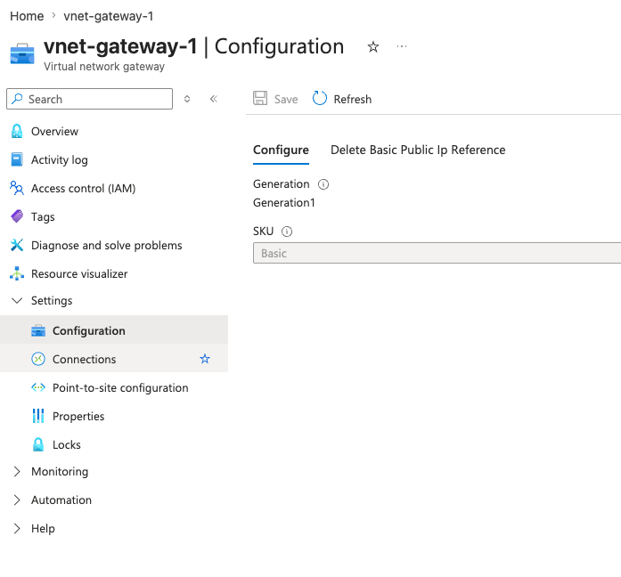

### SSH into the Private VM

The MacBook (plugged into port 4) receives a `10.2.0.100` address from the DHCP server on LAN2. From there, the Azure VM at `10.0.1.4` is reachable directly over the tunnel.

```bash
# Confirm you have an address in the LAN2 range
ifconfig en14
# en14: inet 10.2.0.100 netmask 0xffff0000

# SSH directly to the private IP — no jump host, no Bastion, no public IP
ssh -i ~/.ssh/ed25519 azureuser@10.0.1.4
```

Successful login output:

```
Welcome to Ubuntu 24.04.4 LTS (GNU/Linux 6.17.0-1010-azure x86_64)

  System load:  0.0               Processes:             112
  Usage of /:   5.9% of 28.02GB   Users logged in:       0
  Memory usage: 33%               IPv4 address for eth0: 10.0.1.4

Last login: Fri Apr 17 16:04:54 2026 from 10.2.0.100
```

The `Last login from 10.2.0.100` confirms the connection came through the VPN tunnel from the on-premises LAN2 network.

---

## Key Concepts for AZ-104

| Concept | What to Know |
|---|---|
| **GatewaySubnet** | Mandatory dedicated subnet for VPN/ExpressRoute gateways. Must be named exactly `GatewaySubnet`. Minimum `/29`, recommended `/27`. |
| **VPN Gateway SKU** | Basic: dev/test only. VpnGw1–5: production. SKU determines throughput, connections, and feature support (BGP, active-active, custom policy). |
| **Route-based vs. Policy-based** | Route-based uses traffic selectors (`0.0.0.0/0`) and is required for IKEv2, multi-site, and P2S. Policy-based uses specific selectors and is limited to one tunnel. |
| **Local Network Gateway** | Azure resource that represents the on-premises VPN device. Contains the peer public IP and the address space(s) behind it. |
| **Connection** | The link between the VPN Gateway and the Local Network Gateway. Holds the shared key and IKE/IPsec settings. |
| **IKEv2 vs. IKEv1** | IKEv2 is preferred — faster rekeying, more efficient, required for some SKU features. Basic SKU supports both but only with the default policy. |
| **NAT traversal (NAT-T)** | When the on-premises device is behind NAT (as here), IKE uses UDP 4500 instead of UDP 500 to encapsulate ESP traffic. The ER605 handles this automatically. |
| **Traffic selectors** | Define which source/destination subnets are tunneled. Must be symmetric on both ends. Misconfigured selectors are a common cause of tunnel-up but no-traffic issues. |

---

## Troubleshooting

| Symptom | Likely Cause | Fix |
|---|---|---|
| IPsec SA table empty | Tunnel never established | Check ER605 system log for IKE errors |
| `NO_PROPOSAL_CHOSEN` in logs | Crypto mismatch in Phase 1 or Phase 2 | Use Default (all) proposals on the ER605 side |
| Phase 1 completes but Phase 2 fails | Traffic selector mismatch | Set remote subnet to `10.0.0.0/16` (not a narrower range) |
| Phase 1 fails — ID mismatch | ER605 is behind NAT; local ID defaults to LAN IP | Set Local ID explicitly to the public IP in Phase 1 advanced settings |
| Tunnel shows Connected but no traffic | Traffic selector too narrow, or device is on LAN1 | Verify remote subnet covers all Azure subnets; ensure device is on LAN2 |
| Tunnel drops intermittently | Telenet public IP changed | Update the Local Network Gateway IP address in Azure |
| Device can't reach Azure VMs | Device on LAN1 (`192.168.5.x`), not LAN2 | Plug into a port that is untagged on VLAN3 (e.g., port 4) |

---

## Appendix: Alternative Configuration — strongSwan on Linux

Before the ER605 was set up, the same Azure VPN Gateway was reached from a Hetzner Ubuntu VM using strongSwan. This is a useful reference for understanding the underlying IPsec parameters.

```ini
conn azure-s2s
    type=tunnel
    auto=start
    keyexchange=ikev2
    authby=secret
    left=%defaultroute
    leftid=89.167.64.33          # Hetzner public IP (= Local Network Gateway IP in Azure)
    leftsubnet=10.2.0.0/16
    right=20.103.209.44          # Azure VPN Gateway public IP
    rightsubnet=10.0.0.0/16
    ike=aes256-sha1-modp1024
    esp=aes256-sha1
    keyingtries=%forever
    ikelifetime=28800s
    lifetime=3600s
    dpddelay=30s
    dpdtimeout=120s
    dpdaction=restart
```

Because the Hetzner VM had no interface in `10.2.0.0/16`, a dummy interface was needed to source tunnel traffic from that subnet:

```bash
sudo ip link add dummy0 type dummy
sudo ip link set dummy0 up
sudo ip addr add 10.2.0.1/32 dev dummy0
```

This mirrors what the ER605 does natively — it owns `10.2.0.0/16` as its LAN2 network and sources VPN traffic from within that range automatically.
