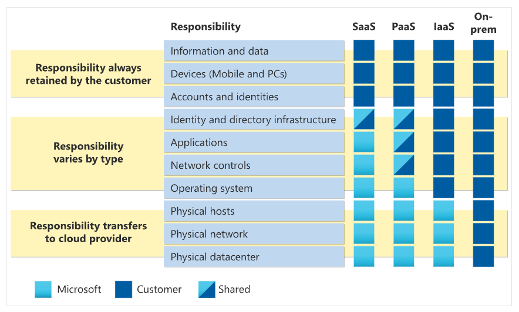
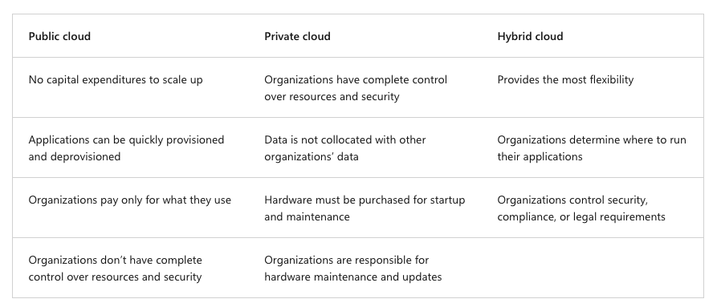

# Cloud Concepts

Covers ~25–30% of the AZ-900 exam. These are foundational ideas that underpin everything else in Azure.

---

## What is Cloud Computing?

Cloud computing is the delivery of computing services — servers, storage, databases, networking, software, analytics, and intelligence — over the internet ("the cloud") with pay-as-you-go pricing.

Key characteristics (NIST definition):
- **On-demand self-service** — provision resources without human interaction with the provider
- **Broad network access** — available over the network from any device
- **Resource pooling** — provider serves multiple customers from shared resources
- **Rapid elasticity** — scale up or down quickly, sometimes automatically
- **Measured service** — usage is monitored and you pay for what you consume

---

## Shared Responsibility Model

The cloud provider and the customer each own a piece of security and operations. What you own depends on the service model.

| Responsibility | On-premises | IaaS | PaaS | SaaS |
|---|---|---|---|---|
| Data & access | Customer | Customer | Customer | Customer |
| Applications | Customer | Customer | Customer | Provider |
| Runtime | Customer | Customer | Provider | Provider |
| OS | Customer | Customer | Provider | Provider |
| Virtualization | Customer | Provider | Provider | Provider |
| Hardware/network | Customer | Provider | Provider | Provider |

**Key exam point:** The customer is *always* responsible for data, identities, and access management — regardless of service model.

So this means

- The information and data stored in the cloud
- Devices that are allowed to connect to your cloud (cell phones, computers, and so on)
- The accounts and identities of the people, services, and devices within your organization

---

## Cloud Service Models

### IaaS — Infrastructure as a Service
You rent virtualized hardware (VMs, storage, networking). You manage the OS and everything above it.

- Examples: Azure Virtual Machines, Azure Disk Storage
- Use when: you need OS-level control, running legacy applications, custom configurations, lift and shift migrations, testing adn deployment

### PaaS — Platform as a Service
You rent a managed platform for running applications. The provider manages the OS, runtime, and middleware.

- Examples: Azure App Service, Azure SQL Database, Azure Functions
- Use when: you want to focus on code and not infrastructure, use development frameworks, built-in software components, analytics and business intelligence, microservices and serverless architectures

### SaaS — Software as a Service
You use a fully managed application delivered over the internet.

- Examples: Microsoft 365, Dynamics 365, GitHub
- Use when: you just need the software, no infrastructure or code management

**Memory aid:** IaaS = rent a car, PaaS = take a taxi, SaaS = take the bus.

---

## Cloud Deployment Models

### Public Cloud
Resources are owned and operated by a third-party provider (Azure, AWS, GCP) and shared across multiple customers over the internet.
- No CapEx to start
- Pay-as-you-go
- Virtually unlimited scalability

### Private Cloud
Cloud infrastructure dedicated to a single organization, hosted on-premises or by a third party.
- Full control and customization
- Higher CapEx
- You're responsible for maintenance

### Hybrid Cloud
Combination of public and private clouds, connected together.
- Keep sensitive workloads on-premises, burst to public cloud for scale
- More flexibility, more complexity

### Multi-cloud
Using services from more than one public cloud provider simultaneously.

**Azure Arc** allows you to manage resources across on-premises, multi-cloud, and edge environments from a single control plane. This is an example of a hybrid/multi-cloud management tool.

**Azure VMWare Solution** allows you to run VMware workloads natively on Azure, enabling a hybrid cloud approach for organizations with existing VMware investments. This is another example of a hybrid cloud solution that helps bridge on-premises and cloud environments.

---

## CapEx vs OpEx

| | CapEx (Capital Expenditure) | OpEx (Operational Expenditure) |
|---|---|---|
| Definition | Upfront investment in physical assets | Ongoing costs for running a service |
| On-premises | High (buy servers, data center) | Lower |
| Cloud | Low to none | Pay-as-you-go |
| Tax treatment | Depreciated over time | Deducted in the same year |

Cloud shifts IT spending from CapEx to OpEx. This is one of the primary financial motivations for cloud adoption.

---

## Benefits of Cloud Computing

| Benefit | What it means |
|---|---|
| **High availability** | Services stay up even when components fail. Measured as SLA (e.g., 99.9%, 99.99%) |
| **Scalability** | Ability to handle increased load — vertical (bigger) or horizontal (more instances) |
| **Elasticity** | Automatically scale resources up and down based on demand |
| **Agility** | Rapidly deploy and iterate on resources without long procurement cycles |
| **Geo-distribution** | Deploy close to users worldwide using regions and CDNs |
| **Disaster recovery** | Replicate data and workloads to other regions for business continuity |
| **Reliability** | Redundancy built in — failures don't take the whole system down |
| **Predictability** | Consistent performance and cost forecasting |
| **Security** | Broad security tooling and compliance certifications |
| **Governance** | Policy enforcement and auditability across your estate |
| **Manageability** | Monitor and manage resources from a single portal, CLI, or API |

## SLAs

number of nines = 100% - SLA
| SLA | Downtime per year | Downtime per month |
|---|---|---|
| 99.0% | 3.65 days | 7.2 hours |
| 99.9% | 8.77 hours | 43.2 minutes |
| 99.95% | 4.38 hours | 21.6 minutes |
| 99.99% | 52.56 minutes | 4.32 minutes |
| 99.999% | 5.26 minutes | 25.9 seconds |
| 99.9999% | 31.5 seconds | 2.59 seconds |
| 99.99999% | 3.15 seconds | 0.315 seconds |

---

---

## Consumption-Based Model

Instead of paying for infrastructure capacity you may or may not use, you pay only for what you consume. Benefits:
- No upfront infrastructure costs
- No wasted capacity
- Scale to meet demand and reduce costs when demand drops
- Ability to pay for additional resources only when needed
