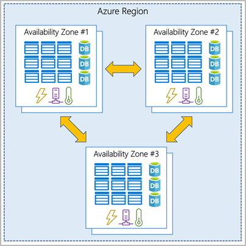
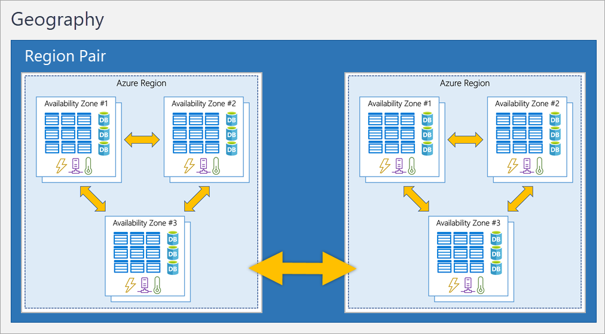
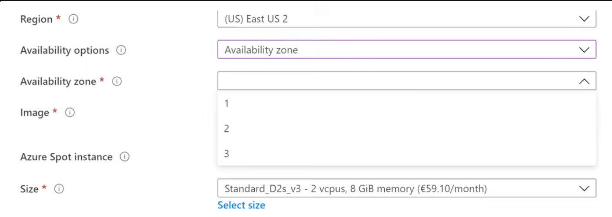
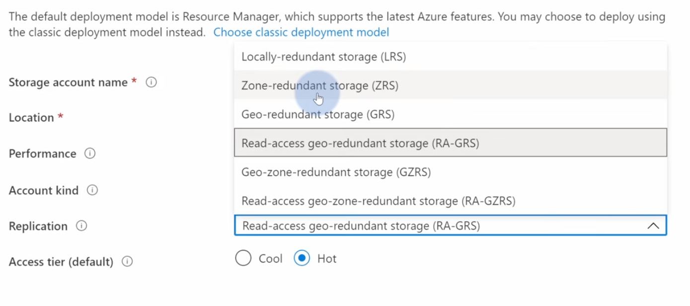
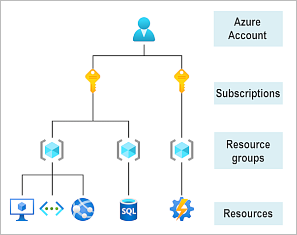
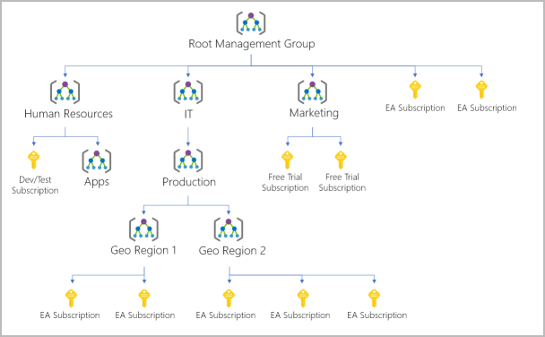

# Azure Architecture

Understanding how Azure is physically and logically organized is fundamental for everything else.

---

## Physical Infrastructure

### Datacenters
Azure runs on thousands of physical datacenters around the world — each with its own power, cooling, and networking.
You don't interact with datacenters directly; they're abstracted into regions and availability zones.

### Regions
A region is a geographic area containing one or more datacenters that are close together and connected via a low-latency network.

- Examples: `West Europe` (Netherlands), `East US`, `Southeast Asia`
- When you deploy a resource, you choose a region
- Not all services are available in all regions
- Data residency and compliance requirements often dictate which region to use

List available regions:
```bash
az account list-locations --output table

DisplayName               Name                 RegionalDisplayName
------------------------  -------------------  -------------------------------------
East US                   eastus               (US) East US
West US 2                 westus2              (US) West US 2
Australia East            australiaeast        (Asia Pacific) Australia East
Southeast Asia            southeastasia        (Asia Pacific) Southeast Asia
North Europe              northeurope          (Europe) North Europe
Sweden Central            swedencentral        (Europe) Sweden Central
West Europe               westeurope           (Europe) West Europe
UK South                  uksouth              (UK) UK South
Central US                centralus            (US) Central US
```



### Region Pairs
Most Azure regions are paired with another region at least 300 miles away in the same geography. Region pairs are used for:
- Geo-redundant storage replication
- Planned maintenance is staggered (one in the pair at a time)
- Recovery priority during outages



Example pairs: `East US` ↔ `West US`, `West Europe` ↔ `North Europe`

### Sovereign Regions
Isolated instances of Azure for specific compliance requirements:
- **Azure Government** — US government agencies
- **Azure China** — operated by 21Vianet, separate from global Azure

---

## Availability Zones

Availability zones are physically separate datacenters within a single region, each with independent power, cooling, and networking.

```
Region: West Europe
├── Zone 1 (Datacenter A)
├── Zone 2 (Datacenter B)
└── Zone 3 (Datacenter C)
```

- Not all regions support availability zones
- Deploying across zones protects against datacenter-level failures
- Services are either
      - **zonal** (VMs , disks , ... pinned to a zone)
      - **zone-redundant** (sql, storage, ... automatically spread)
      - **non-regional** (not tied to a zone)


Example zonal services: Azure Virtual Machines. You can choose which zone to deploy in for higher availability. If one zone goes down, VMs in other zones are unaffected.



Example zone-redundant services: Azure SQL Database, Azure Storage, Azure App Service. These services automatically replicate across zones within the region for high availability. You don't choose a zone for these — you just get zone-level redundancy.




SLA impact:
| Deployment | VM SLA |
|---|---|
| Single VM with Premium SSD | 99.9% |
| VMs in an Availability Set | 99.95% |
| VMs across Availability Zones | 99.99% |

Check which regions support zones:
```bash
az account list-locations --query "[?availabilityZoneMappings != null].name" --output table
```

No all regions have availability zones, but all regions have multiple datacenters. You can still achieve high availability by deploying across multiple regions if zones aren't available.
If a region has an availability zone, there are at least 3 zones in that region. You can deploy resources across those zones for higher availability. If a region doesn't have zones, you can still achieve high availability by deploying across multiple regions.


---

## Logical Infrastructure

### Overview



### Resources
A resource is any manageable item in Azure — a VM, a storage account, a virtual network, a database, etc.

### Resource Groups
A resource group is a logical container for related resources. It holds resources that share the same lifecycle — you deploy, manage, and delete them together.

Rules and behaviors:
- Every resource must belong to exactly one resource group
- A resource group exists in a region, but can contain resources from other regions
- Deleting a resource group deletes all resources inside it
- Permissions (RBAC) and policies can be applied at the resource group level

```bash
# Create
az group create --name my-rg --location westeurope

# List
az group list --output table

# Delete (and everything in it)
az group delete --name my-rg --yes --no-wait
```

### Subscriptions
A subscription is a billing and access boundary in Azure. All resources belong to a subscription.

- A single Azure account can have multiple subscriptions
- Each subscription has its own billing, cost tracking, and limits/quotas
- Common pattern: separate subscriptions for dev, staging, production
- RBAC can be applied at subscription level

```bash
az account list --output table
az account show
az account set --subscription "<id-or-name>"
```

### Management Groups
Management groups sit above subscriptions and allow you to organize multiple subscriptions into a hierarchy for governance at scale.

```
Root Management Group
├── Management Group: Production
│   ├── Subscription: Prod-East
│   └── Subscription: Prod-West
├── Management Group: Development
│   └── Subscription: Dev
```



- Azure Policy and RBAC applied to a management group inherits down to all subscriptions within it
- Up to 6 levels deep (not counting root)
- Each Azure AD tenant has a single root management group

Example usage :

- Apply a security policy to all production subscriptions by applying it to the "Production" management group
- Grant read-only access to all development subscriptions by assigning a role at the "Development" management group level
- Organize subscriptions by department, project, or environment using management groups for better governance and cost management

---

## Azure Resource Manager (ARM)

ARM is the deployment and management layer for Azure. Every interaction — portal, CLI, PowerShell, REST API — goes through ARM.

```
You (CLI / Portal / SDK)
        ↓
  Azure Resource Manager
        ↓
  Individual Services (Compute, Storage, Network...)
```

ARM provides:
- **Unified API** — consistent way to manage all resources
- **Declarative templates** — define infrastructure as JSON (ARM templates) or Bicep
- **Dependency management** — deploy resources in the right order
- **RBAC** — access control integrated at every level
- **Tagging** — metadata on resources for organization and cost tracking
- **Locking** — prevent accidental deletion or modification

---

## Interacting with Azure

Azure exposes everything through ARM, which means you can manage resources using any of these interfaces interchangeably — they all call the same underlying API.

### Azure Portal

A web-based GUI at [portal.azure.com](https://portal.azure.com). Good for exploration, one-off tasks, and learning what options exist.

- Point-and-click interface for creating and managing resources
- Built-in dashboards, cost views, monitoring charts
- Not suitable for repeatable deployments or automation
- Useful for validating what the CLI or templates create

### Azure Cloud Shell

A browser-based shell built directly into the portal (click the `>_` icon in the top bar). No local installation needed.

- Choose **Bash** (runs Azure CLI) or **PowerShell** (runs Az PowerShell module)
- Your home directory persists between sessions via an Azure Files share
- Pre-authenticated — no need to run `az login`
- Useful when you're on a machine where you haven't installed the CLI

```bash
# Switch between Bash and PowerShell using the dropdown in Cloud Shell
# Files stored in ~/clouddrive persist across sessions
```

### Azure CLI

A cross-platform command-line tool (`az`) for managing Azure resources from your local terminal. Install once, works on macOS, Linux, and Windows.

```bash
# Authenticate
az login

# Set a default subscription
az account set --subscription "<name-or-id>"

# Set default resource group and location (avoids repeating them in every command)
az configure --defaults group=my-rg location=westeurope

# General command structure:
# az <service> <action> [options]
az vm create ...
az group list ...
az storage account show ...
```

Common patterns:

```bash
# Output as table (readable), json (scriptable), or tsv (parseable)
az resource list --output table
az resource list --output json

# Query with JMESPath to filter output
az vm list --query "[].{Name:name, RG:resourceGroup}" --output table

# Use --no-wait to kick off long-running operations without blocking
az vm start --name my-vm --resource-group my-rg --no-wait
```

### Azure PowerShell

A PowerShell module (`Az`) that wraps the same ARM API. Preferred in Windows-heavy or enterprise environments where PowerShell is already the scripting standard.

```powershell
# Install the module
Install-Module -Name Az -Scope CurrentUser

# Authenticate
Connect-AzAccount

# List resource groups
Get-AzResourceGroup | Format-Table

# General command structure:
# <Verb>-Az<Service> [parameters]
Get-AzVM
New-AzResourceGroup -Name my-rg -Location westeurope
Remove-AzVM -Name my-vm -ResourceGroupName my-rg
```

### Choosing the right tool

| Tool | Best for |
|---|---|
| **Azure Portal** | Exploration, one-off tasks, learning the UI, dashboards |
| **Cloud Shell** | Quick CLI/PowerShell tasks without a local install, always authenticated |
| **Azure CLI** | Scripting, automation, CI/CD pipelines, cross-platform teams |
| **Azure PowerShell** | Windows/enterprise environments, existing PowerShell workflows |
| **ARM templates / Bicep** | Repeatable, version-controlled infrastructure deployments |

> **Exam tip:** The portal, CLI, PowerShell, and REST API all go through ARM — they are different *interfaces* to the same underlying service. Any resource you create in the portal can also be created with the CLI using the same parameters.

---

## Scope Hierarchy

Azure has four levels of management scope. Policies, RBAC, and costs flow down:

```
Management Groups
    └── Subscriptions
            └── Resource Groups
                    └── Resources
```

Apply a policy at the Management Group level → applies to all subscriptions and resources below it.
Apply RBAC at the Resource Group level → applies to all resources within that group.
