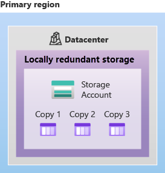
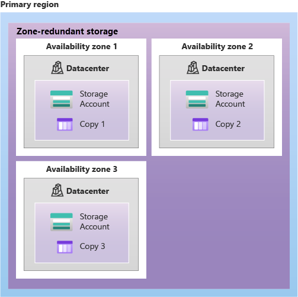
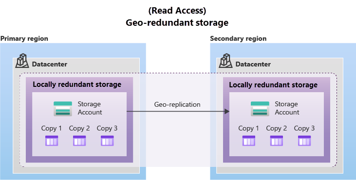
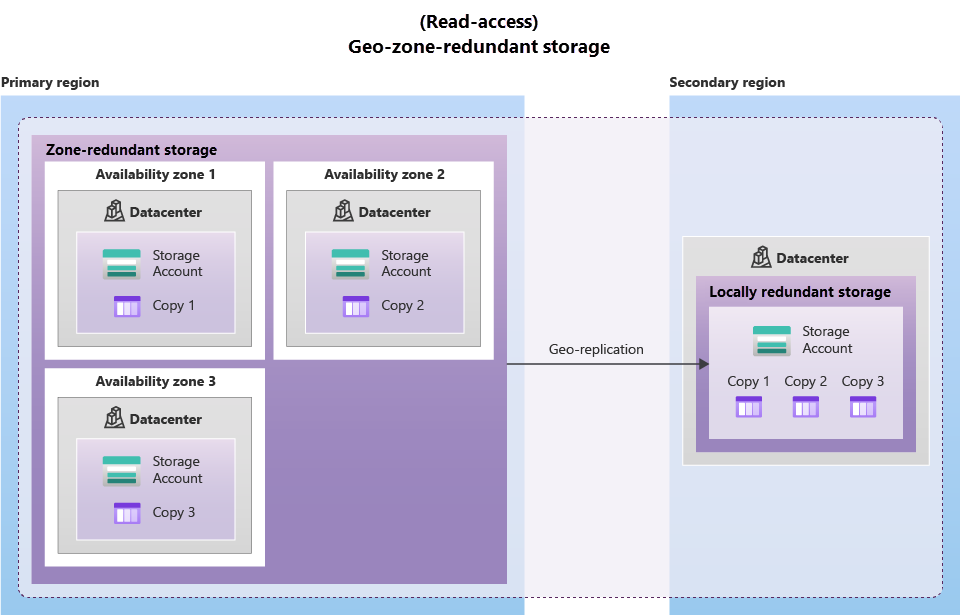

# Azure Storage

Azure Storage is a managed cloud storage solution offering different storage types for different data shapes and access patterns.

---

## Storage Account

All Azure Storage services live inside a **storage account** — the top-level container for your data.

```bash
az storage account create \
  --name mystorageacct123 \
  --resource-group my-rg \
  --location westeurope \
  --sku Standard_LRS \
  --kind StorageV2
```

- Account name must be globally unique (3–24 chars, lowercase letters and numbers only)
- The SKU controls redundancy (see below)
- `StorageV2` (general-purpose v2) is the recommended type — supports all storage services

### Types

- Standard general-purpose v2
- Premium block blobs (high-performance SSD for block blobs)
- Premium file shares (high-performance SSD for file shares)
- Premium page blobs (high-performance SSD for page blobs, used for VM disks)


### Redundancy Options

- **LRS** : Locally redundant storage
- **GRS** : Geo-redundant storage
- **RA-GRS** : Read-access geo-redundant storage
- **ZRS** : Zone-redundant storage
- **GZRS** : Geo-zone-redundant storage
- **RA-GZRS** : Read-access geo-zone-redundant storage

---

## Storage Services

### Blob Storage
Object storage for unstructured data — files, images, videos, backups, logs, anything.

- Accessible via HTTP/S from anywhere
- Three blob types:
  - **Block blobs** — most common; text, binary, media files
  - **Append blobs** — optimized for append operations; log files
  - **Page blobs** — random read/write; used for VM disks (VHDs)
- Organized into: Storage Account → Container → Blob

```bash
# Create a container
az storage container create --name mycontainer --account-name mystorageacct123

# Upload a file
az storage blob upload \
  --account-name mystorageacct123 \
  --container-name mycontainer \
  --name myfile.txt \
  --file ./myfile.txt

# List blobs
az storage blob list \
  --account-name mystorageacct123 \
  --container-name mycontainer \
  --output table
```

### Access Tiers (Blob)
Blob storage has four access tiers optimized for different access frequencies:

| Tier | Access frequency | Storage cost | Access cost | Min storage duration |
|---|---|---|---|---|
| **Hot** | Frequent | High | Low | None |
| **Cool** | Infrequent (≥30 days) | Lower | Higher | 30 days |
| **Cold** | Rare (≥90 days) | Lower | Higher | 90 days |
| **Archive** | Rarely, offline | Lowest | Highest | 180 days |

- Archive blobs must be "rehydrated" before they can be read (takes hours)
- Lifecycle management policies can automatically move blobs between tiers

### Azure File Storage
Fully managed file shares accessible over SMB (Server Message Block) and NFS protocols.

- Can be mounted on Windows, Linux, and macOS — just like a network drive
- Use case: lift-and-shift apps that need shared file system access, replacing on-premises file servers
- Supports Azure File Sync to sync on-premises file servers with cloud shares

```bash
az storage share create \
  --name myfileshare \
  --account-name mystorageacct123 \
  --quota 10
```

### Azure Queue Storage
Message queue for storing large numbers of messages accessible via HTTP/S.

- Each message can be up to 64 KB
- Queue can hold millions of messages
- Use case: decouple application components, asynchronous processing

```bash
az storage queue create --name my-queue --account-name mystorageacct123
az storage message put --queue-name my-queue --account-name mystorageacct123 --content "hello"
```

### Azure Table Storage
NoSQL key-value store for structured, non-relational data.

- Schema-less — each row can have different columns
- Fast for simple key-based lookups
- Use case: storing large amounts of structured data that doesn't need relational queries
- Lower cost than Azure SQL or Cosmos DB for simple scenarios

### Azure Disk Storage
Block-level storage volumes used as virtual hard disks for Azure VMs.

- **Managed disks** — Azure manages storage account complexity for you (recommended)
- Disk types by performance:

| Type | Backing | Use case |
|---|---|---|
| Ultra Disk | SSD | Mission-critical, highest IOPS |
| Premium SSD v2 | SSD | Production databases |
| Premium SSD | SSD | Production workloads |
| Standard SSD | SSD | Dev/test, light production |
| Standard HDD | HDD | Backup, archival, non-critical |

---

## Storage Redundancy

Redundancy protects your data against hardware failures. More redundancy = higher cost and higher durability.

### Within a region

| Option | Full name | Description |
|---|---|---|
| **LRS** | Locally Redundant Storage | 3 synchronous copies within a single datacenter |
| **ZRS** | Zone-Redundant Storage | 3 synchronous copies across 3 availability zones in one region |





### Cross-region (geo-redundant)

| Option | Full name | Description |
|---|---|---|
| **GRS** | Geo-Redundant Storage | LRS in primary + async copy to secondary region (LRS) |
| **GZRS** | Geo-Zone-Redundant Storage | ZRS in primary + async copy to secondary region (LRS) |
| **RA-GRS** | Read-Access GRS | GRS + read access to secondary region |
| **RA-GZRS** | Read-Access GZRS | GZRS + read access to secondary region |





Durability: all options provide at least **11 nines** (99.999999999%) of durability.

Because data is replicated to the secondary region asynchronously, a failure that affects the primary region may result in data loss if the primary region can't be recovered. The interval between the most recent writes to the primary region and the last write to the secondary region is known as the recovery point objective (RPO). The RPO indicates the point in time to which data can be recovered. Azure Storage typically has an RPO of less than 15 minutes, although there's currently no SLA on how long it takes to replicate data to the secondary region.


**Key exam point:** secondary region data is read-only unless a failover is initiated (unless using RA-GRS/RA-GZRS).

---

## Storage Summary

| Service | Use for |
|---|---|
| Blob | Unstructured files, media, backups |
| Files | Shared drives (SMB/NFS mount) |
| Queue | Message queuing between services |
| Table | Simple structured NoSQL data |
| Disk | VM hard drives |

---

## Data Migration

Moving large amounts of data to Azure is not always practical over the internet. Azure provides two tools depending on the size of the data and the available network bandwidth.

---

### Azure Migrate

A centralised hub for **discovering, assessing, and migrating** on-premises workloads to Azure. It covers servers, databases, web apps, and virtual desktops — not just storage.

**What it does:**
- **Discovery & assessment** — scans your on-premises environment, maps dependencies, and estimates Azure costs and sizing
- **Server migration** — replicates on-premises VMs (VMware, Hyper-V, physical) to Azure VMs
- **Database migration** — assesses and migrates SQL Server, MySQL, PostgreSQL to Azure managed services
- **Web app migration** — assesses and migrates ASP.NET web apps to Azure App Service

**How it works:**
1. Set up the Azure Migrate project in the portal
2. Deploy a lightweight **discovery appliance** (a VM) in your on-premises environment
3. The appliance scans servers and sends metadata to Azure
4. Review the assessment (recommended VM sizes, monthly cost estimate, readiness)
5. Start replication and cut over when ready

```bash
# Create an Azure Migrate project
az migrate project create \
  --resource-group my-rg \
  --name my-migrate-project \
  --location westeurope
```

**Key exam points:**
- Azure Migrate is the answer for **lift-and-shift server migrations** to Azure
- It provides a **readiness report** showing which workloads are ready, need remediation, or are not suitable for Azure
- It is free to use — you only pay for the Azure resources you migrate into

---

### Azure Data Box

A family of **physical devices** Microsoft ships to you for transferring large volumes of data to Azure when uploading over the internet is too slow, too expensive, or not feasible.

You copy data onto the device, ship it back to Microsoft, and Microsoft uploads it to your Azure Storage account.

**Why use it instead of uploading over the network?**

| Data size | Time to upload at 1 Gbps | Recommendation |
|---|---|---|
| 1 TB | ~2.5 hours | Upload over the network |
| 10 TB | ~1 day | Borderline — Data Box worth considering |
| 100 TB | ~11 days | Use Data Box |
| 1 PB | ~3 months | Use Data Box Heavy |

**Data Box product family:**

| Product | Capacity | Use case |
|---|---|---|
| **Data Box Disk** | Up to 35 TB (set of SSDs) | Small migrations, fast turnaround |
| **Data Box** | 80 TB usable | Standard large migrations |
| **Data Box Heavy** | ~800 TB | Very large datacenter migrations |
| **Data Box Gateway** | Virtual appliance (no physical device) | Continuous online data transfer to Azure |

**Typical workflow:**

1. Order a Data Box from the Azure portal
2. Microsoft ships the device to you (preconfigured, encrypted)
3. Connect the device to your network and copy data to it (via SMB, NFS, or REST)
4. Ship the device back to Microsoft
5. Microsoft uploads the data to your nominated Azure Storage account and securely wipes the device
6. You receive a confirmation once the upload is complete

```bash
# Order a Data Box (done via the portal or this CLI command)
az databox job create \
  --resource-group my-rg \
  --name my-databox-job \
  --location westeurope \
  --sku DataBox \
  --contact-name "Your Name" \
  --phone "0123456789" \
  --email-list "you@example.com" \
  --street-address1 "123 Main St" \
  --city "Amsterdam" \
  --postal-code "1234AB" \
  --country "NL" \
  --storage-account mystorageacct123
```

**Key exam points:**
- Data Box is the answer when the question mentions **large data volumes**, **slow or limited internet**, or **offline transfer**
- Data is **encrypted at rest** on the device (AES 256-bit) — if the device is lost or stolen, data cannot be read
- After upload, Microsoft performs a **secure wipe** of the device following NIST 800-88r1 standards
- Data Box is a **one-time or infrequent** migration tool; for continuous data transfer use **Data Box Gateway** (virtual) or **Azure File Sync** (for file shares)

---

### Choosing Between Azure Migrate and Data Box

| Scenario | Tool |
|---|---|
| Moving servers, databases, or web apps to Azure | Azure Migrate |
| Transferring large volumes of files/blobs to Azure Storage | Azure Data Box |
| Network bandwidth is limited or transfer would take weeks | Azure Data Box |
| You need an assessment of your on-premises estate before migrating | Azure Migrate |
| Continuous ongoing sync of on-premises files to Azure Files | Azure File Sync |

---

## Shared Access Signatures (SAS)

A SAS provides delegated, time-limited, permission-scoped access to storage resources without sharing account keys.

```bash
# Generate a SAS token for a blob
az storage blob generate-sas \
  --account-name mystorageacct123 \
  --container-name mycontainer \
  --name myfile.txt \
  --permissions r \
  --expiry 2025-12-31
```
